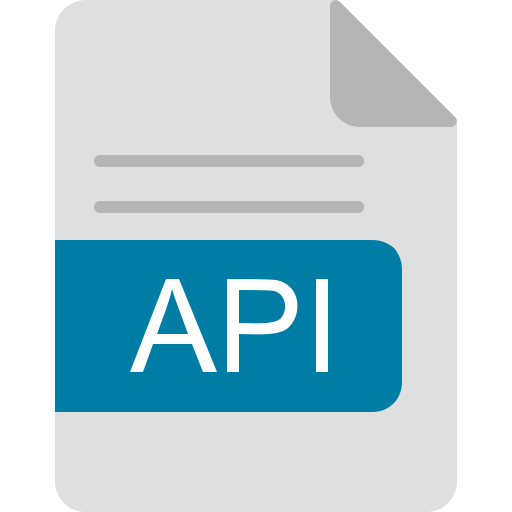

[](https://github.com/eclipse-zenoh/zenoh-kotlin/actions?query=workflow%3A%22CI%22)
[](https://github.com/eclipse-zenoh/zenoh-kotlin/actions/workflows/release.yml)
[](https://github.com/eclipse-zenoh/roadmap/discussions)
[](https://discord.gg/2GJ958VuHs)
[](https://choosealicense.com/licenses/epl-2.0/)
[](https://opensource.org/licenses/Apache-2.0)

# Eclipse Zenoh

The Eclipse Zenoh: Zero Overhead Pub/sub, Store/Query and Compute.

Zenoh (pronounce _/zeno/_) unifies data in motion, data at rest and computations. It carefully blends traditional pub/sub with geo-distributed storages, queries and computations, while retaining a level of time and space efficiency that is well beyond any of the mainstream stacks.

Check the website [zenoh.io](http://zenoh.io) and the [roadmap](https://github.com/eclipse-zenoh/roadmap) for more detailed information.

----

#   Kotlin API

This repository provides a Kotlin binding based on the main [Zenoh implementation written in Rust](https://github.com/eclipse-zenoh/zenoh).

The code relies on the Zenoh JNI native library, which written in Rust and communicates with the Kotlin layer via the Java Native Interface (JNI).

##  Documentation

The documentation of the API is published at <https://eclipse-zenoh.github.io/zenoh-kotlin/index.html>.

Alternatively, you can build it locally as [explained below](#building-the-documentation).

----

# How to import

##  Android

First add the Maven central repository to your `settings.gradle.kts`:

```kotlin
dependencyResolutionManagement {
    // ...
    repositories {
        mavenCentral()
    }
}
```

After that add to the dependencies in the app's `build.gradle.kts`:

```kotlin
implementation("org.eclipse.zenoh:zenoh-kotlin-android:1.1.1")
```

### Platforms

The library targets the following platforms:

- x86
- x86_64
- arm
- arm64

### SDK

The minimum SDK is 30.

### Permissions

Zenoh is a communications protocol, therefore the permissions required are:

```xml
<uses-permission android:name="android.permission.INTERNET"/>
<uses-permission android:name="android.permission.ACCESS_NETWORK_STATE"/>
```

### Example

Checkout the [Zenoh demo app](https://github.com/eclipse-zenoh/zenoh-demos/tree/main/zenoh-android/ZenohApp) for an example on how to use the library.

----

##   JVM

First add the Maven central repository to your `settings.gradle.kts`:

```kotlin
dependencyResolutionManagement {
    // ...
    repositories {
        mavenCentral()
    }
}
```

After that add to the dependencies in the app's `build.gradle.kts`:

```kotlin
implementation("org.eclipse.zenoh:zenoh-kotlin-jvm:1.1.1")
```

### Platforms

For the moment, the library targets the following platforms:

- x86_64-unknown-linux-gnu
- aarch64-unknown-linux-gnu
- x86_64-apple-darwin
- aarch64-apple-darwin
- x86_64-pc-windows-msvc
- aarch64-pc-windows-msvc

----

# How to build it

## What you need

Basically:

- Kotlin ([Installation guide](https://kotlinlang.org/docs/getting-started.html#backend))
- Gradle ([Installation guide](https://gradle.org/install/))

and in case of targetting Android you'll also need:

- Android SDK ([Installation guide](https://developer.android.com/about/versions/11/setup-sdk))

> **Note:** zenoh-kotlin no longer builds its own native JNI library. The native runtime is provided by [zenoh-jni-runtime](https://github.com/eclipse-zenoh/zenoh-java), which is a published Maven artifact that zenoh-kotlin depends on automatically. No Rust toolchain is required to build or publish zenoh-kotlin using the default (Maven) path. A Rust toolchain is only needed when using the [local submodule path](#running-the-tests) with `-Pzenoh.useLocalJniRuntime=true`.

##  JVM

To publish a library for a JVM project into Maven local, run

```bash
gradle publishJvmPublicationToMavenLocal
```

This publishes the zenoh-kotlin library to Maven local. The published artifact declares a dependency on `zenoh-jni-runtime`, which provides the native JNI binaries and is published separately by the [zenoh-java](https://github.com/eclipse-zenoh/zenoh-java) project.

Once we have published the package, we should be able to find it under `~/.m2/repository/org/eclipse/zenoh/zenoh-kotlin-jvm/1.1.1`.

Finally, in the `build.gradle.kts` file of the project where you intend to use this library, add mavenLocal to the list of repositories and add zenoh-kotlin as a dependency:

```kotlin
repositories {
    mavenCentral()
    mavenLocal()
}

dependencies {
    implementation("org.eclipse.zenoh:zenoh-kotlin-jvm:1.1.1")
}
```

##  Android

In order to use these bindings in a native Android project, publish them into Maven local:

```bash
gradle -Pandroid=true publishAndroidReleasePublicationToMavenLocal
```

This publishes the zenoh-kotlin-android artifact to Maven local. The published artifact declares a dependency on `zenoh-jni-runtime`, which provides the prebuilt native JNI binaries for Android ABIs (x86, x86_64, arm, arm64). The native binaries are published separately by the [zenoh-java](https://github.com/eclipse-zenoh/zenoh-java) project — no Rust toolchain or NDK cross-compilation is required.

You should now be able to see the package under `~/.m2/repository/org/eclipse/zenoh/zenoh-kotlin-android/1.1.1`.

Finally, in the `build.gradle.kts` file of the project where you intend to use this library, add mavenLocal to the list of repositories and add zenoh-kotlin-android as a dependency:

```kotlin
repositories {
    mavenCentral()
    mavenLocal()
}

dependencies {
    implementation("org.eclipse.zenoh:zenoh-kotlin-android:1.1.1")
}
```

Reminder that in order to work during runtime, the following permissions must be enabled in the app's manifest:

```xml
<uses-permission android:name="android.permission.INTERNET" />
<uses-permission android:name="android.permission.ACCESS_NETWORK_STATE" />
```

## Building the documentation

Because it's a Kotlin project, we use [Dokka](https://kotlinlang.org/docs/dokka-introduction.html) to generate the documentation.

In order to build it, run:

```bash
gradle dokkaGenerate
```

## Running the tests

zenoh-kotlin supports two modes for providing the native JNI runtime during tests:

### Default mode (published Maven artifact)

By default, tests resolve `zenoh-jni-runtime` from Maven Central. No local submodule or Rust toolchain is needed:

```bash
gradle jvmTest
```

### Local submodule mode (opt-in)

For local integration testing against the `zenoh-java` submodule (included under `zenoh-java/`), pass the `zenoh.useLocalJniRuntime` property. This substitutes the Maven dependency with a local composite build of the submodule:

```bash
gradle jvmTest -Pzenoh.useLocalJniRuntime=true
```

> **Note:** The local submodule path builds `zenoh-jni-runtime` from source and requires a Rust toolchain (see [rustup.rs](https://rustup.rs)) as well as the Cargo toolchain configured for the target platform. The submodule's Gradle build handles the Rust compilation step automatically once the toolchain is installed.

## Logging

Rust logs are propagated when setting the `RUST_LOG` environment variable.

For instance running the ZPub test as follows:

```bash
RUST_LOG=debug gradle ZPub
```

causes the logs to appear in standard output.

The log levels are the ones from Rust, typically `trace`, `info`, `debug`, `error` and `warn` (though other log filtering options are available, see <https://docs.rs/env_logger/latest/env_logger/#enabling-logging>).

Alternatively, the logs can be enabled programmatically through `Zenoh.initLogFromEnvOr(logfilter)`, for instance:

```kotlin
Zenoh.initLogFromEnvOr("debug")
```

----

# Examples

You can find some examples located under the [`/examples` folder](examples). Checkout the [examples README file](/examples/README.md).

----

# Old packages

Old released versions were published into Github packages.

In case you want to use one of the versions published into github packages, add the Github packages repository to your `settings.gradle.kts` as follows:

```kotlin
dependencyResolutionManagement {
    // ...
    repositories {
        google()
        mavenCentral()
        maven {
            name = "GitHubPackages"
            url = uri("https://maven.pkg.github.com/eclipse-zenoh/zenoh-kotlin")
            credentials {
                username = providers.gradleProperty("user").get()
                password = providers.gradleProperty("token").get()
            }
        }
    }
}
```

where the username and token are your github username and a personal access token you need to generate on github with package read permissions (see the [Github documentation](https://docs.github.com/en/authentication/keeping-your-account-and-data-secure/managing-your-personal-access-tokens)).
This is required by Github in order to import the package, even if it's from a public repository.

Then after that, add the dependency as usual:

```kotlin
dependencies {
    implementation("org.eclipse.zenoh:zenoh-kotlin-jvm:<version>")
}
```
